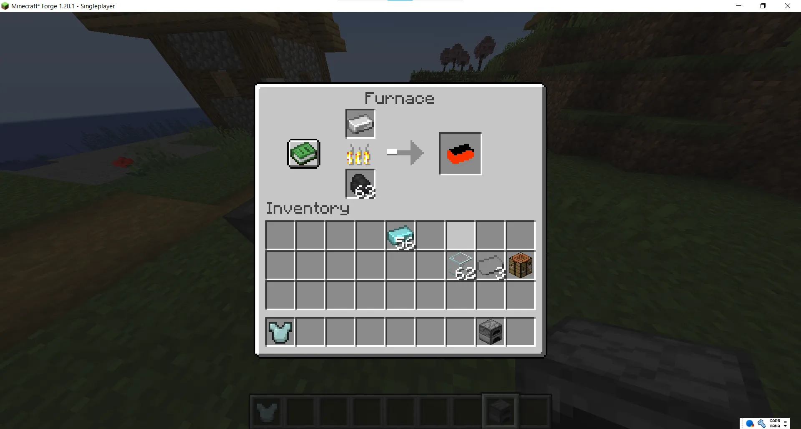
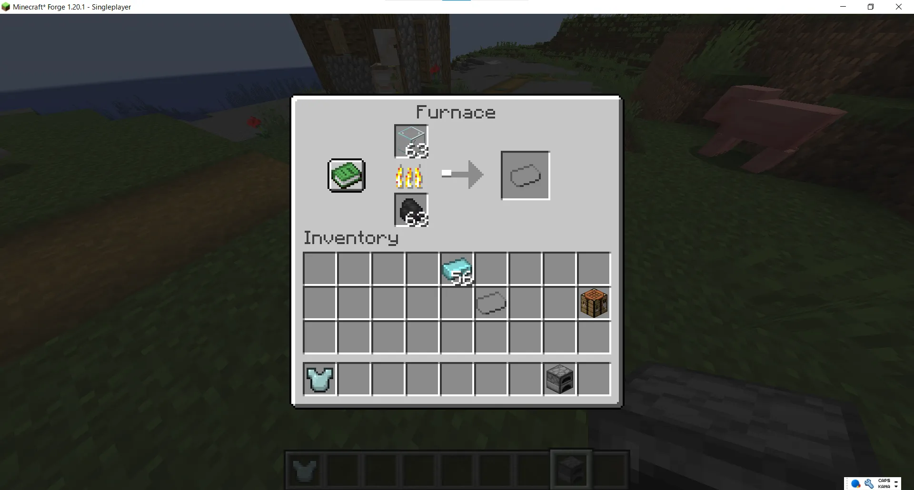
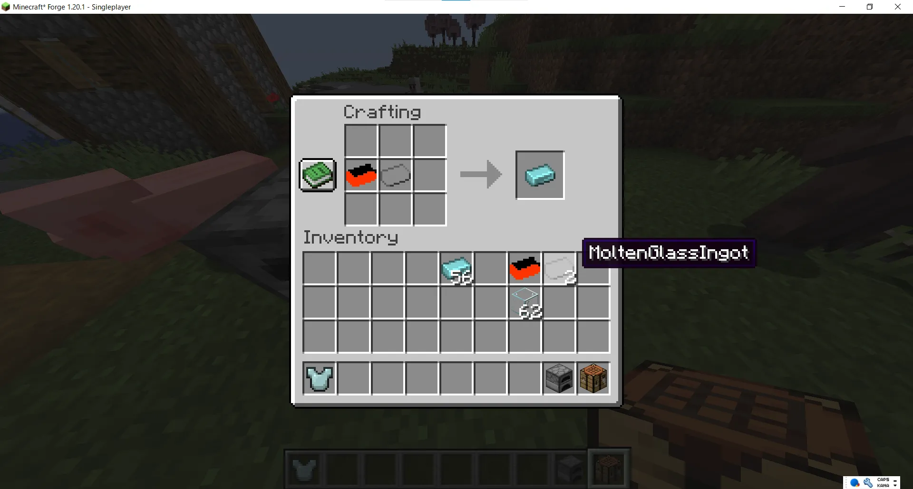
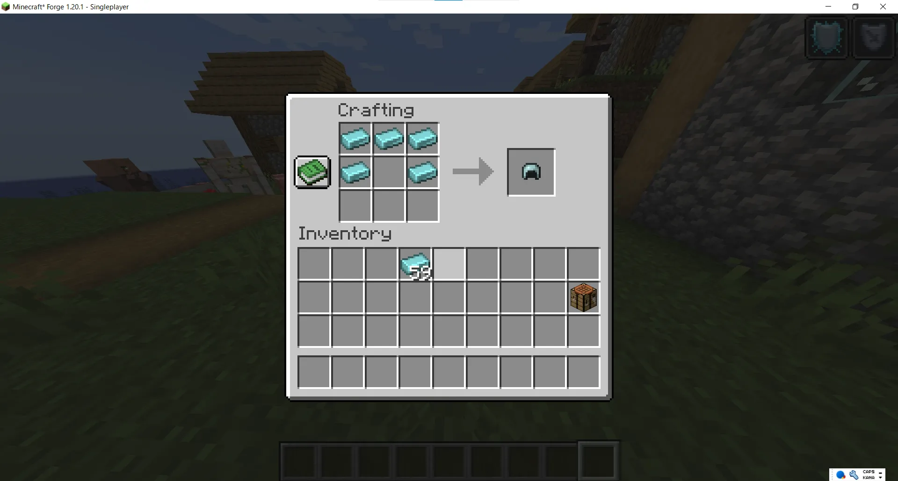
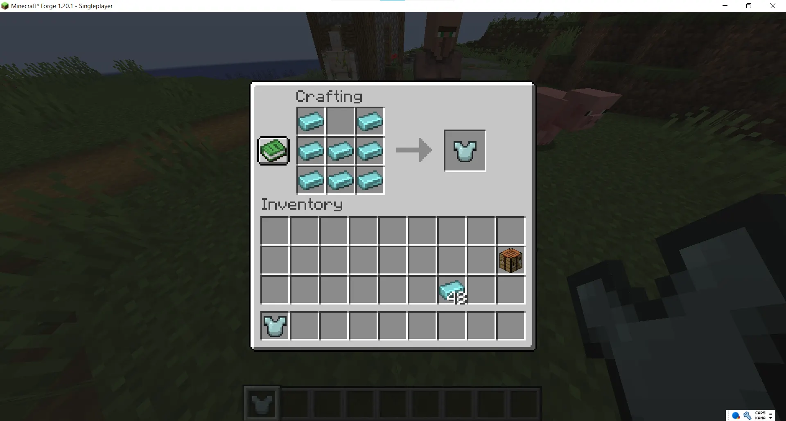
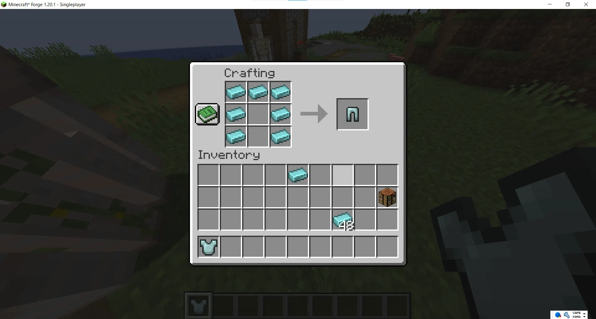
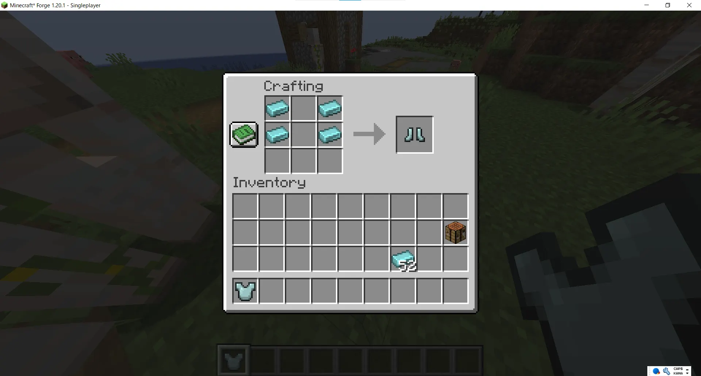

# GhostArmorMod
## Description
**GhostArmorMod** is an original mod developed for Minecraft Forge 1.20.1.
It adds ghostly armor that makes you invisible to hostile mobs in Minecraft!

## Features
- New items: GhostIngot, MoltenGlassIngot, and SmeltedIronIngot 
- New armor pieces: GhostHelmet, GhostChestPlate, GhostLeggings, and GhostBoots
- Equip the full set of armor to become transparent like a ghost
- With the full set equipped, you can fly through the air like a ghost by pressing the **Z key**

## Installation
To install GhostArmor, follow these steps:

1. Download the latest mod file from the provided https://www.curseforge.com/minecraft/mc-mods/ghostarmor/files/all?page=1&pageSize=20&showAlphaFiles=hide
2. Place the downloaded file into your Minecraft `mods` folder 
3. Make sure Minecraft 1.20.1 and Forge version 47.4.8 (or later) are installed 

## Usage

Equip all of the following: GhostHelmet, GhostChestPlate, GhostLeggings, and GhostBoots. 
When the full set is worn, hostile mobs will not attack you, even at close range. 
You can also fly through the air like a ghost by pressing the **Z key**.

## Crafting Recipes

**SmeltedIronIngot**: Smelt an Iron Ingot in a furnace to obtain!

**MoltenGlassIngot**: Smelt a Glass Block in a furnace to obtain!

**GhostIngot**: Place one SmeltedIronIngot and one MoltenGlassIngot in the crafting table to obtain!  

**GhostHelmet**: Arrange GhostIngots in the shape of a helmet on the crafting table to craft!  

**GhostChestPlate**: Arrange GhostIngots in the shape of a chestplate on the crafting table to craft!  

**GhostLeggings**: Arrange GhostIngots in the shape of leggings on the crafting table to craft!  

**GhostBoots**: Arrange GhostIngots in the shape of boots on the crafting table to craft!

## Contributing
If you would like to contribute to this project, please follow these steps:

1. Fork the repository.
2. Create a new branch (e.g., `feature/new-feature`).
3. Make your changes and commit them.
4. Open a pull request.

## License
This project is licensed under the MIT License. See the LICENSE file for more details.

## Build Instructions
1. From here download JDK https://adoptium.net/temurin/archive/?version=17

2. From here download Forge https://files.minecraftforge.net/net/minecraftforge/forge/index_1.20.1.html

3. Launch IntelliJ IDEA and open this project.

4. After auto importing project files on the right side of IntelliJ IDEA, find the "Gradle" tab. Expand `GhostArmorMod -> Tasks -> build` and double-click on `build` to build the project.

5. The built file is in the `GhostArmorMod/build/libs` folder.
   Place the file into your Minecraft `mods` folder and enjoy the mod!

## Known Issues
There are no known bugs at the moment, but if you find any, we apologize. Please use it at your own risk.